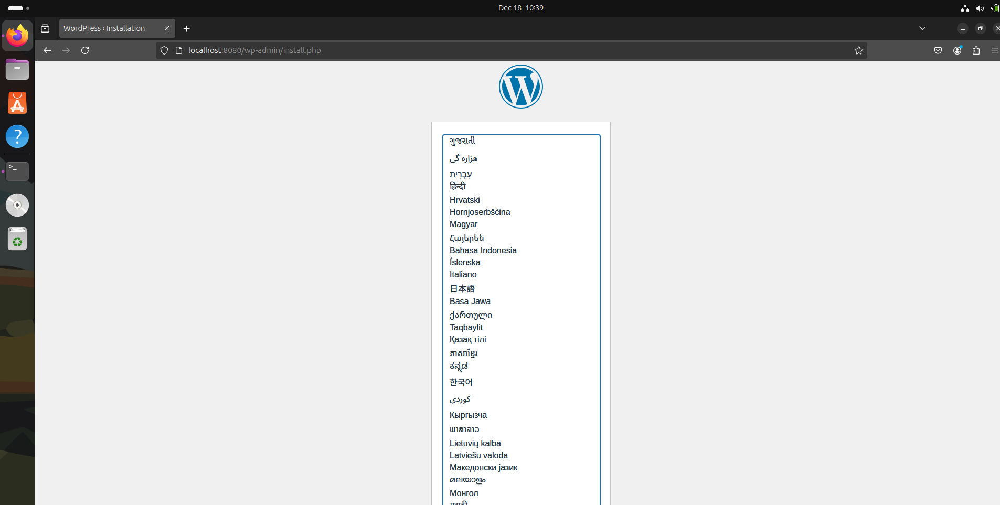

# TP 1

1. Création

```
root@mael-vb:/home/mael# docker run -d -p 25500:80 --name web nginx
1e182d8f50e44b02c7a3d8b427b51359f0960979ac2d357d5afe86bd0ebca6fc
```
Test
```
root@mael-vb:/home/mael# curl 0.0.0:25500
<!DOCTYPE html>
<html>
<head>
<title>Welcome to nginx!</title>
<style>
html { color-scheme: light dark; }
body { width: 35em; margin: 0 auto;
font-family: Tahoma, Verdana, Arial, sans-serif; }
</style>
</head>
<body>
<h1>Welcome to nginx!</h1>
<p>If you see this page, the nginx web server is successfully installed and
working. Further configuration is required.</p>

<p>For online documentation and support please refer to
<a href="http://nginx.org/">nginx.org</a>.<br/>
Commercial support is available at
<a href="http://nginx.com/">nginx.com</a>.</p>

<p><em>Thank you for using nginx.</em></p>
</body>
</html>
```

2. Explorer le conteneur

```
root@mael-vb:/home/mael# docker ps
CONTAINER ID   IMAGE     COMMAND                  CREATED         STATUS         PORTS                                       NAMES
1e182d8f50e4   nginx     "/docker-entrypoint.…"   3 minutes ago   Up 3 minutes   0.0.0.0:25500->80/tcp, [::]:25500->80/tcp   web
```

```
root@mael-vb:/home/mael# docker inspect web
[
    {
    [...]
                "IPAddress": "172.17.0.2",
    }
]
```

3. Logs
```
root@mael-vb:/home/mael# docker logs -f web
/docker-entrypoint.sh: /docker-entrypoint.d/ is not empty, will attempt to perform configuration
/docker-entrypoint.sh: Looking for shell scripts in /docker-entrypoint.d/
/docker-entrypoint.sh: Launching /docker-entrypoint.d/10-listen-on-ipv6-by-default.sh
10-listen-on-ipv6-by-default.sh: info: Getting the checksum of /etc/nginx/conf.d/default.conf
10-listen-on-ipv6-by-default.sh: info: Enabled listen on IPv6 in /etc/nginx/conf.d/default.conf
/docker-entrypoint.sh: Sourcing /docker-entrypoint.d/15-local-resolvers.envsh
/docker-entrypoint.sh: Launching /docker-entrypoint.d/20-envsubst-on-templates.sh
/docker-entrypoint.sh: Launching /docker-entrypoint.d/30-tune-worker-processes.sh
/docker-entrypoint.sh: Configuration complete; ready for start up
2025/12/18 08:54:35 [notice] 1#1: using the "epoll" event method
2025/12/18 08:54:35 [notice] 1#1: nginx/1.29.4
2025/12/18 08:54:35 [notice] 1#1: built by gcc 14.2.0 (Debian 14.2.0-19)
2025/12/18 08:54:35 [notice] 1#1: OS: Linux 6.8.0-51-generic
2025/12/18 08:54:35 [notice] 1#1: getrlimit(RLIMIT_NOFILE): 1024:524288
2025/12/18 08:54:35 [notice] 1#1: start worker processes
2025/12/18 08:54:35 [notice] 1#1: start worker process 29
2025/12/18 08:54:35 [notice] 1#1: start worker process 30
172.17.0.1 - - [18/Dec/2025:08:54:41 +0000] "GET / HTTP/1.1" 200 615 "-" "curl/8.5.0" "-"
```

4. Intéragir
```
docker^Croot@mael-vb:/home/mael# docker exec -it web /bin/bash
root@1e182d8f50e4:/# ls
bin  boot  dev  docker-entrypoint.d  docker-entrypoint.sh  etc  home  lib  lib64  media  mnt  opt  proc  root  run  sbin  srv  sys  tmp  usr  var
```

```
root@1e182d8f50e4:/# cat /usr/share/nginx/html/index.html
<!DOCTYPE html>
<html>
<head>
<title>Welcome to nginx!</title>
<style>
html { color-scheme: light dark; }
body { width: 35em; margin: 0 auto;
font-family: Tahoma, Verdana, Arial, sans-serif; }
</style>
</head>
<body>
<h1>Welcome to nginx!</h1>
<p>If you see this page, the nginx web server is successfully installed and
working. Further configuration is required.</p>

<p>For online documentation and support please refer to
<a href="http://nginx.org/">nginx.org</a>.<br/>
Commercial support is available at
<a href="http://nginx.com/">nginx.com</a>.</p>

<p><em>Thank you for using nginx.</em></p>
</body>
</html>
```

5. Arrêter le conteneur

```
root@mael-vb:/home/mael# docker stop 1e182d8f50e4
1e182d8f50e4
root@mael-vb:/home/mael# sudo docker rm 1e182d8f50e4
1e182d8f50e4
```

## TP 2

```
root@mael-vb:/home/mael/linuxb2# echo "cc" >> index.html
root@mael-vb:/home/mael/linuxb2# cat Dockerfile
FROM nginx:alpine

COPY index.html /usr/share/nginx/html/index.html

EXPOSE 80
root@mael-vb:/home/mael/linuxb2# docker build -t mon-site:v1 .

root@mael-vb:/home/mael/linuxb2# docker images
REPOSITORY   TAG       IMAGE ID       CREATED              SIZE
mon-site     v1        e12d3c14f128   About a minute ago   53.7MB
root@mael-vb:/home/mael/linuxb2# docker run -d --name mon-site-v1 -p 1443:80 mon-site:v1
root@mael-vb:/home/mael/linuxb2# curl 0.0.0.0:01443
cc
```

### Questions

1. Plus légère
2. Sinon les deux images ont le même tag, et c'est pas possible donc l'autre perd son tag
3. docker images ls -a 

## TP 3
```
version: "3.9"

services:
  mysql:
    image: mysql:8
    container_name: mysql
    restart: always
    environment:
      MYSQL_ROOT_PASSWORD: rootpassword
      MYSQL_DATABASE: wordpress
      MYSQL_USER: wpuser
      MYSQL_PASSWORD: wppassword
    volumes:
      - mysql_data:/var/lib/mysql

  wordpress:
    image: wordpress:latest
    container_name: wordpress
    restart: always
    ports:
      - "8080:80"
    environment:
      WORDPRESS_DB_HOST: mysql:3306
      WORDPRESS_DB_NAME: wordpress
      WORDPRESS_DB_USER: wpuser
      WORDPRESS_DB_PASSWORD: wppassword
    volumes:
      - wp_data:/var/www/html
    depends_on:
      - mysql

  phpmyadmin:
    image: phpmyadmin:latest
    container_name: phpmyadmin
    restart: always
    ports:
      - "8081:80"
    environment:
      PMA_HOST: mysql
      PMA_PORT: 3306
    depends_on:
      - mysql

volumes:
  mysql_data:
  wp_data:
```
```
root@mael-vb:/home/mael/linuxb2# docker compose up -d
[+] Running 3/3
 ✔ Container mysql       Running                                                      0.0s
 ✔ Container phpmyadmin  Running                                                      0.0s
 ✔ Container wordpress   Started                                                      0.3s
```



4. Relancer
```
root@mael-vb:/home/mael/linuxb2# docker compose down
WARN[0000] /home/mael/linuxb2/docker-compose.yml: the attribute `version` is obsolete, it will be ignored, please remove it to avoid potential confusion
[+] Running 4/4
 ✔ Container wordpress      Removed                                                   1.4s
 ✔ Container phpmyadmin     Removed                                                   1.4s
 ✔ Container mysql          Removed                                                   0.9s
 ✔ Network linuxb2_default  Removed                                                   0.1s
root@mael-vb:/home/mael/linuxb2# docker compose up -d
WARN[0000] /home/mael/linuxb2/docker-compose.yml: the attribute `version` is obsolete, it will be ignored, please remove it to avoid potential confusion
[+] Running 4/4
 ✔ Network linuxb2_default  Created                                                   0.1s
 ✔ Container mysql          Started                                                   0.7s
 ✔ Container phpmyadmin     Started                                                   1.6s
 ✔ Container wordpress      Started                                                   1.4s
```

Oui il est encore la l'article

5. 
- depends_on permet de definir l'ordre de lancement, si web depend de mysql, mysql se lancera avant web.
- volume nommé => volume géré par docker, "virtuel" alors que le bound mout c'est vraiment un fichier de l'hote, vraiment un lien direct
- docker compose avec un dns interne

## TP 4 

```
root@mael-vb:/home/mael/linuxb2# podman run -d --name nginx-podman -p 8080:80 nginx
Resolving "nginx" using unqualified-search registries (/etc/containers/registries.conf)
Trying to pull docker.io/library/nginx:latest...
Getting image source signatures
Copying blob 114e699da838 done   |
Copying blob 1733a4cd5954 done   |
root@mael-vb:/home/mael/linuxb2# podman ps
CONTAINER ID  IMAGE                           COMMAND               CREATED         STATUS         PORTS                 NAMES
2ef8aaccde1f  docker.io/library/nginx:latest  nginx -g daemon o...  17 seconds ago  Up 17 seconds  0.0.0.0:8080->80/tcp  nginx-podman
root@mael-vb:/home/mael/linuxb2# curl localhost:8080
<!DOCTYPE html>
<html>
<head>
<title>Welcome to nginx!</title>
<style>
html { color-scheme: light dark; }
body { width: 35em; margin: 0 auto;
font-family: Tahoma, Verdana, Arial, sans-serif; }
</style>
</head>
<body>
<h1>Welcome to nginx!</h1>
<p>If you see this page, the nginx web server is successfully installed and
working. Further configuration is required.</p>

<p>For online documentation and support please refer to
<a href="http://nginx.org/">nginx.org</a>.<br/>
Commercial support is available at
<a href="http://nginx.com/">nginx.com</a>.</p>

<p><em>Thank you for using nginx.</em></p>
</body>
</html>
```

```
root@mael-vb:/home/mael/linuxb2# podman pod create \
  --name mon-pod \
  -p 8081:80
a0c5ed2b9c71efbfa7b596d3099b3b906c7cf13b04b976c96c310fb8639500b1
root@mael-vb:/home/mael/linuxb2# podman run -d \
  --name nginx-pod \
  --pod mon-pod \
  docker.io/library/nginx:latest
9c89689003eaa5b5994e35c54a2aae4d47c98a06bcf0d56e933e78ca6cf2d810
root@mael-vb:/home/mael/linuxb2# podman run -d \
  --name redis-pod \
  --pod mon-pod \
  docker.io/library/redis:latest
Trying to pull docker.io/library/redis:latest...
Getting image source signatures
Copying blob 4f4fb700ef54 done   |
root@mael-vb:/home/mael/linuxb2# podman ps
podman pod inspect mon-pod
CONTAINER ID  IMAGE                           COMMAND               CREATED         STATUS         PORTS                 NAMES
2ef8aaccde1f  docker.io/library/nginx:latest  nginx -g daemon o...  17 minutes ago  Up 17 minutes  0.0.0.0:8080->80/tcp  nginx-podman
232ffde57157  localhost/podman-pause:4.9.3-0                        30 seconds ago  Up 22 seconds  0.0.0.0:8081->80/tcp  a0c5ed2b9c71-infra
9c89689003ea  docker.io/library/nginx:latest  nginx -g daemon o...  21 seconds ago  Up 22 seconds  0.0.0.0:8081->80/tcp  nginx-pod
b02562f52e25  docker.io/library/redis:latest  redis-server          7 seconds ago   Up 7 seconds   0.0.0.0:8081->80/tcp  redis-pod

{
     "Id": "a0c5ed2b9c71efbfa7b596d3099b3b906c7cf13b04b976c96c310fb8639500b1",
     "Name": "mon-pod",
     "Created": "2025-12-18T11:13:47.328817903+01:00",
     "CreateCommand": [
          "podman",
          "pod",
          "create",
          "--name",
          "mon-pod",
          "-p",
          "8081:80"
     ],
     "ExitPolicy": "continue",
     "State": "Running",
     "Hostname": "",
     "CreateCgroup": true,
     "CgroupParent": "machine.slice",
     "CgroupPath": "machine.slice/machine-libpod_pod_a0c5ed2b9c71efbfa7b596d3099b3b906c7cf13b04b976c96c310fb8639500b1.slice",
     "CreateInfra": true,
     "InfraContainerID": "232ffde571576be0659676035de1eeec1c2b33c420952774213d2d1a477c2b91",
     "InfraConfig": {
          "PortBindings": {
               "80/tcp": [
                    {
                         "HostIp": "",
                         "HostPort": "8081"
                    }
               ]
          },
          "HostNetwork": false,
          "StaticIP": "",
          "StaticMAC": "",
          "NoManageResolvConf": false,
          "DNSServer": null,
          "DNSSearch": null,
          "DNSOption": null,
          "NoManageHosts": false,
          "HostAdd": null,
          "Networks": [
               "podman"
          ],
          "NetworkOptions": null,
          "pid_ns": "private",
          "userns": "host",
          "uts_ns": "private"
     },
     "SharedNamespaces": [
          "ipc",
          "net",
          "uts"
     ],
     "NumContainers": 3,
     "Containers": [
          {
               "Id": "232ffde571576be0659676035de1eeec1c2b33c420952774213d2d1a477c2b91",
               "Name": "a0c5ed2b9c71-infra",
               "State": "running"
          },
          {
               "Id": "9c89689003eaa5b5994e35c54a2aae4d47c98a06bcf0d56e933e78ca6cf2d810",
               "Name": "nginx-pod",
               "State": "running"
          },
          {
               "Id": "b02562f52e25ace2c4cd593eda4da5b15b7ac9eaef6f3ec00d1a4578c37c2568",
               "Name": "redis-pod",
               "State": "running"
          }
     ],
     "LockNumber": 1
}   
```

## TP 6

```
root@mael-vb:/home/mael/linuxb2/tp8# docker compose up -d --build --scale app=3
WARN[0000] /home/mael/linuxb2/tp8/docker-compose.yml: the attribute `version` is obsolete, it will be ignored, please remove it to avoid potential confusion
[+] Running 18/18
 ✔ redis Pulled                                                                       5.2s
   ✔ f637881d1138 Pull complete                                                       1.3s
   ✔ 60c57c0072ef Pull complete                                                       1.4s
   ✔ fc4343b4accd Pull complete                                                       1.6s
   ✔ 380e8aa8b1fd Pull complete                                                       1.6s
   ✔ c70aae7b5e0d Pull complete                                                       3.1s
   ✔ 232f7549c9b0 Pull complete                                                       3.1s
   ✔ 4f4fb700ef54 Pull complete                                                       3.2s
   ✔ d75b3becd998 Pull complete                                                       3.2s
 ✔ nginx Pulled                                                                       2.6s
   ✔ 1074353eec0d Already exists                                                      0.0s
   ✔ 25f453064fd3 Already exists                                                      0.0s
   ✔ 567f84da6fbd Already exists                                                      0.0s
   ✔ da7c973d8b92 Already exists                                                      0.0s
   ✔ 33f95a0f3229 Already exists                                                      0.0s
   ✔ 085c5e5aaa8e Already exists                                                      0.0s
   ✔ 0abf9e567266 Already exists                                                      0.0s
   ✔ de54cb821236 Already exists                                                      0.0s
[+] Running 9/9
 ✔ tp8-app                  Built                                                     0.0s
 ✔ Network tp8_backend      Created                                                   0.1s
 ✔ Network tp8_frontend     Created                                                   0.1s
 ✔ Volume "tp8_redis_data"  Created                                                   0.0s
 ✔ Container tp8-redis-1    Healthy                                                   6.3s
 ✔ Container tp8-app-3      Started                                                   7.8s
 ✔ Container tp8-app-1      Started                                                   7.0s
 ✔ Container tp8-app-2      Started                                                   6.5s
 ✔ Container tp8-nginx-1    Started                                                   8.6s
```

```
root@mael-vb:/home/mael/linuxb2/tp8# for i in $(seq 1 10); do curl -s http://localhost/; done
visits=1 | hostname=9decc787db1a
visits=2 | hostname=032518424f39
visits=3 | hostname=d732f703386a
visits=4 | hostname=9decc787db1a
visits=5 | hostname=032518424f39
visits=6 | hostname=d732f703386a
visits=7 | hostname=9decc787db1a
visits=8 | hostname=032518424f39
visits=9 | hostname=d732f703386a
visits=10 | hostname=9decc787db1a
```

1) Pourquoi Redis n’est accessible que depuis le réseau backend ?

Car y'a que l'app qui doit avoir accès, pas les utilisateurs ou autre

2) Que se passe-t-il si vous tuez un conteneur app ?

Le load balancer continuera à envoyer du trafic vers les instances restantes. Le service reste disponible (dégradation potentielle du débit). Tu peux relancer une instance (--scale app=3 ou docker compose up -d) et elle réintègre le pool.

3) Comment le compteur peut-il être partagé entre les 3 instances ?

Parce que l’état (le compteur) n’est pas dans les conteneurs, mais dans Redis, qui est un service commun. Chaque instance fait INCR sur la même clé → compteur global cohérent.